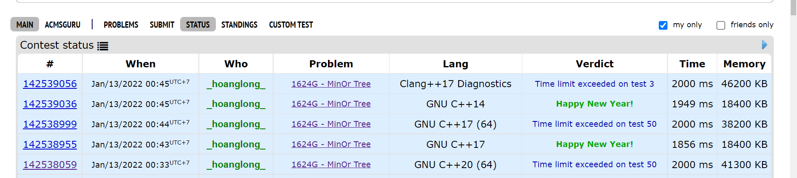

# Kinh nghiệm, những lỗi nên tránh

## Version - C++17 recommended

Nhìn vào hình trên này sẽ thấy kết quả sẽ khác nhau với những trình biên dịch khác nhau.  
**C++17** được ưu tiên lựa chọn hơn cả vì nó đã qua được bài test, sử dụng đủ lâu, và cũng ko cần thiết nhưng hàm mới có trên C++20.  
Submit [142538955- Accepted](https://codeforces.com/contest/1624/submission/142538955) và [142538059-TLE](https://codeforces.com/contest/1624/submission/142538059)
## Recursion

Backtracking nên `hạn chế sử dụng` nếu không bắt buộc.   
Tham khảo submit [1624E-142480482](https://codeforces.com/contest/1624/submission/142480482) sử dụng dynamic programming thay vì backtracking trong [1624E-142405963](https://codeforces.com/contest/1624/submission/142405963). 